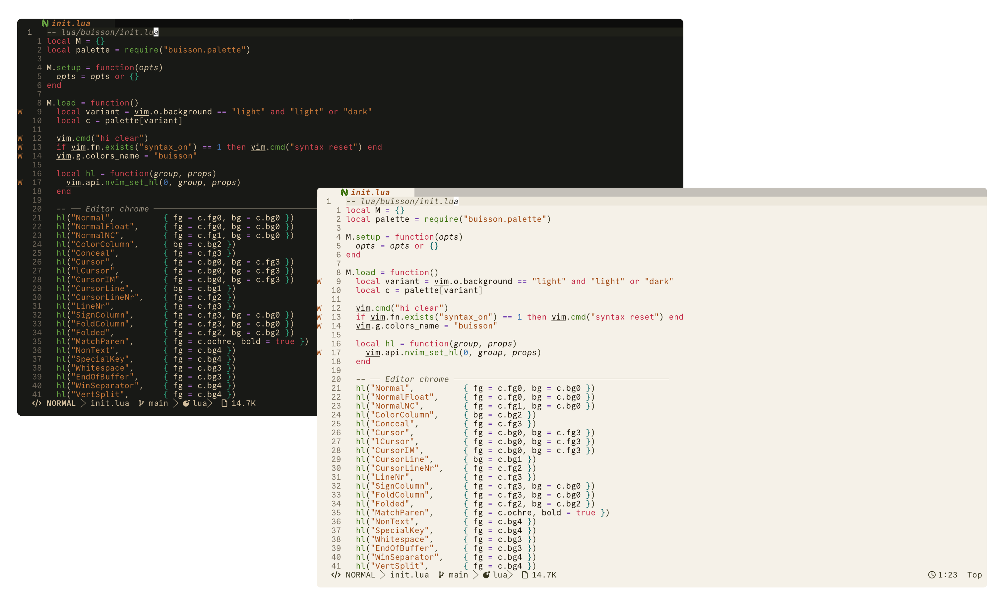

# nvim

> *From the French — a thicket, a tangle of wild growth at the edge of a path.*

An inky botanical color scheme for Neovim. Warm paper backgrounds, botanical ink accents, WCAG-calibrated contrasts.


## Installation

### Neovim 0.12 `vim.pack`

```lua
vim.pack.add({
  { src = "https://github.com/buisson-theme/nvim" },
})
```

### lazy.nvim

```lua
{
  "buisson-theme/nvim",
  priority = 1000,
  config = function()
    vim.cmd.colorscheme("buisson")
  end,
}
```

### packer.nvim

```lua
use({
  "buisson-theme/nvim",
  config = function()
    vim.cmd.colorscheme("buisson")
  end,
})
```

### vim-plug

```vim
Plug 'buisson-theme/nvim'
```

Then load it after `plug#end()`:

```vim
colorscheme buisson
```

## Usage

Load the colorscheme directly:

```vim
colorscheme buisson
```

Or from Lua:

```lua
vim.cmd.colorscheme("buisson")
```

## Variants

The `buisson` colorscheme uses Neovim's `background` option to choose the palette:

```lua
vim.o.background = "dark"
vim.cmd.colorscheme("buisson")
```

```lua
vim.o.background = "light"
vim.cmd.colorscheme("buisson")
```

Set `background` before loading the colorscheme.

## Features

- Dark and light variants
- 6 botanical accent colors with semantic roles
- WCAG AA contrast on all accents
- Primary text: 11.55:1 AAA (dark) / 15.15:1 AAA (light)
- Works out of the box — no Style Settings plugin required

## Palette

| Name | Dark | Light | Role |
|------|------|-------|------|
| Hibiscus | `#d04550` | `#c02040` | Keywords, booleans, exceptions |
| Sage | `#6aaa44` | `#387008` | Functions, method calls |
| River Moss | `#2ea882` | `#096868` | Types, classes, interfaces |
| Slate Sky | `#4878ba` | `#1860a8` | Numbers, numeric constants |
| Thistle | `#b070d0` | `#6028a8` | Operators, decorators |
| Ochre | `#c87838` | `#a04810` | Strings, template literals |

## Source

Part of the [buisson](https://github.com/Adriusops/buisson) monorepo.

## License

MIT — see [LICENSE](LICENSE)
